# StardewCraft

스타듀 밸리 농장에 스타크래프트 유닛이 쳐들어오는 **패스스루(passthrough) 모드**입니다.
화면은 스타듀 하나지만, 그 안에서 움직이는 저글링·질럿·마린은 실제 스타크래프트 엔진
([OpenBW](https://github.com/OpenBW/openbw))이 별도 프로세스에서 시뮬레이션합니다.
두 게임이 공유 메모리로 매 프레임 상태를 주고받습니다.

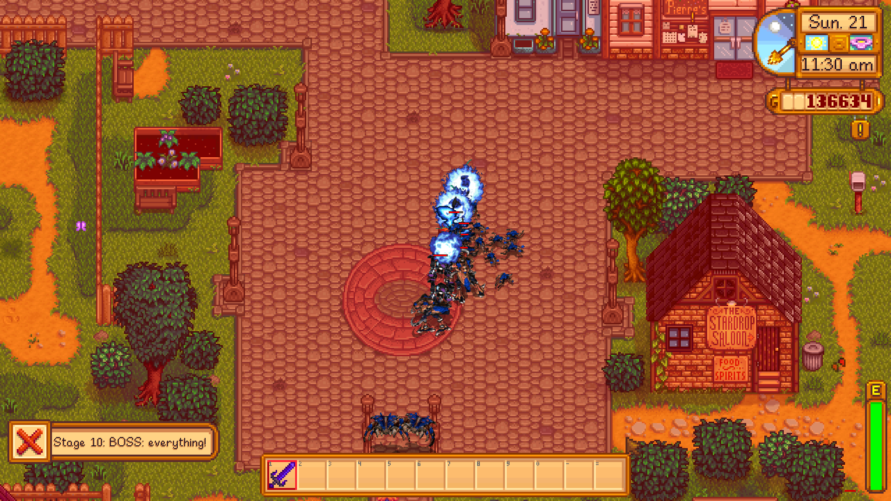

## 스크린샷

모든 장면은 게임 안에서 F8로 찍었습니다.

| | |
|---|---|
|  | 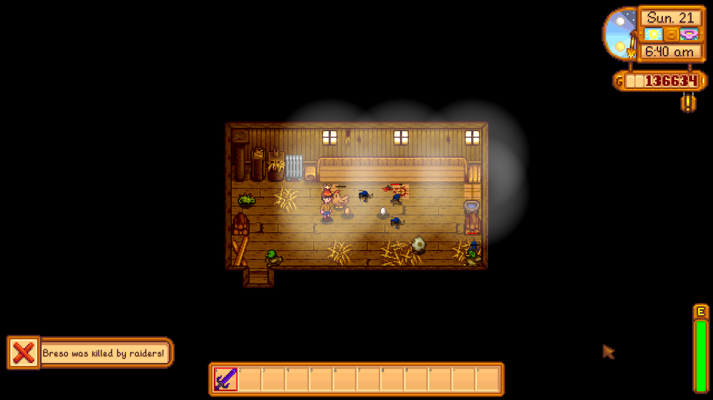 |
| 1단계: 닭장에 나타난 저글링 정찰대 | 동물이 쓰러지면 알림이 뜹니다 |
| 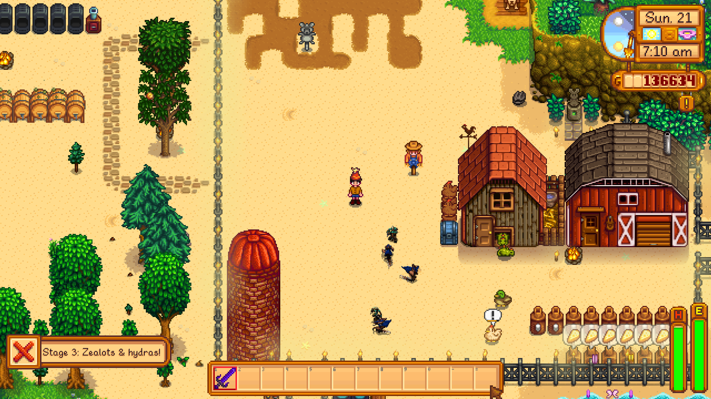 | 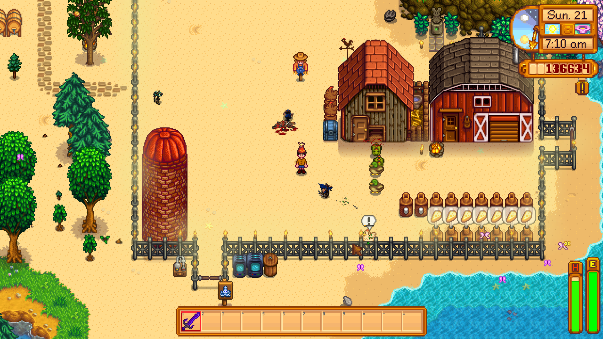 |
| 3단계: 질럿과 히드라 | 농장 동물 곁에서 벌어진 전투 |
| 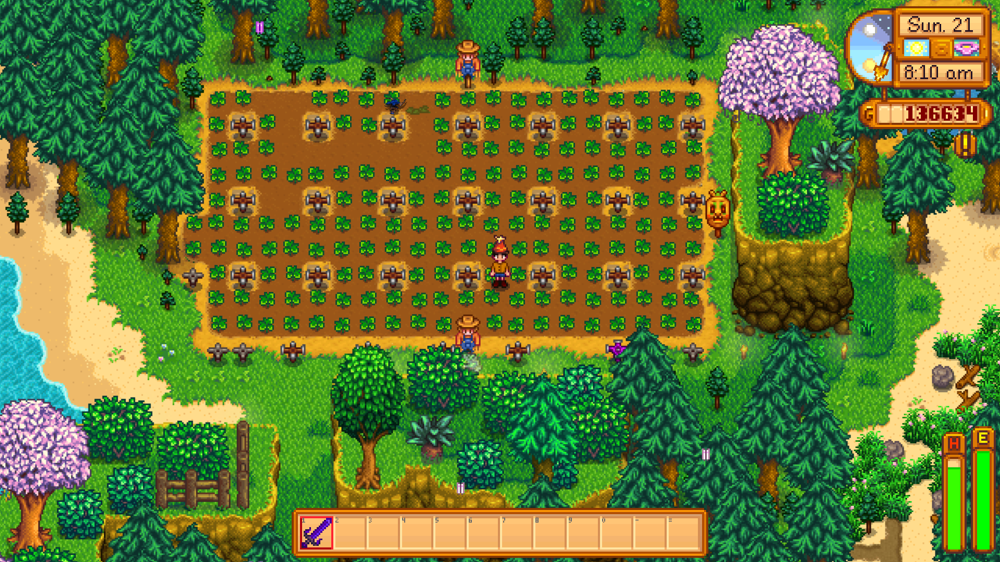 | 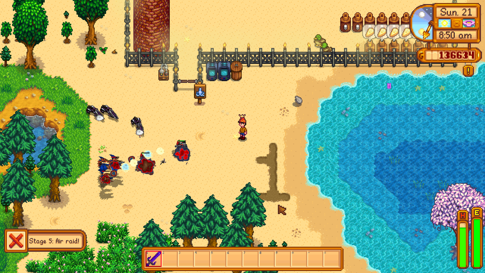 |
| 작물을 노리고 밭에 들어온 저글링 | 5단계: 공중 습격 |
| 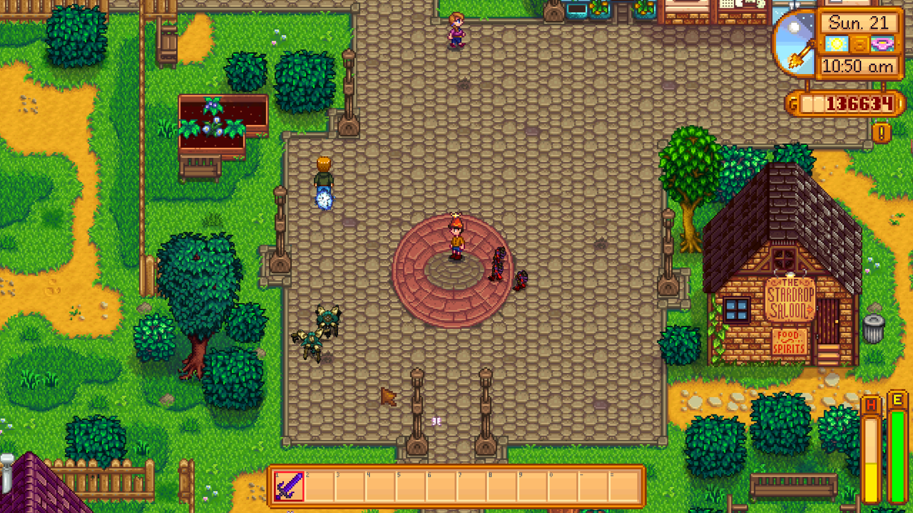 | 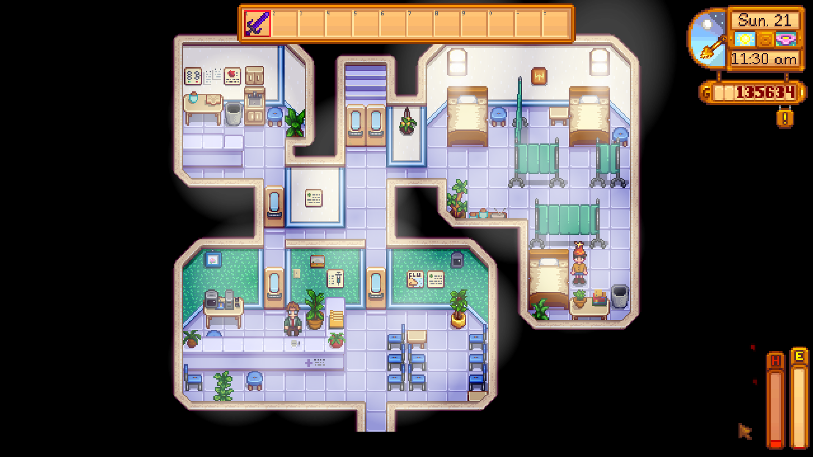 |
| 주민이 칼을 들고 합류 | 지면 병원에서 깨어나고 돈을 잃습니다 |

<details>
<summary>전체 17장</summary>

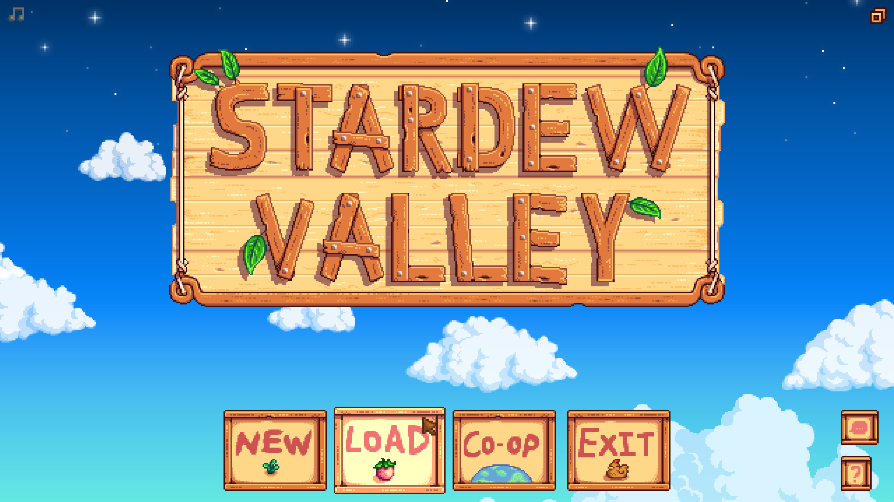
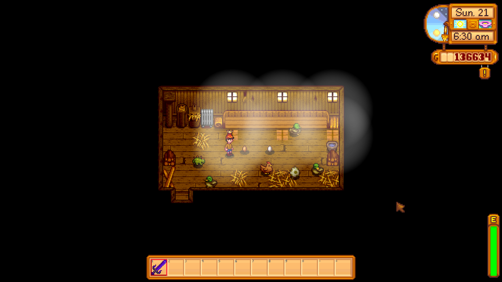


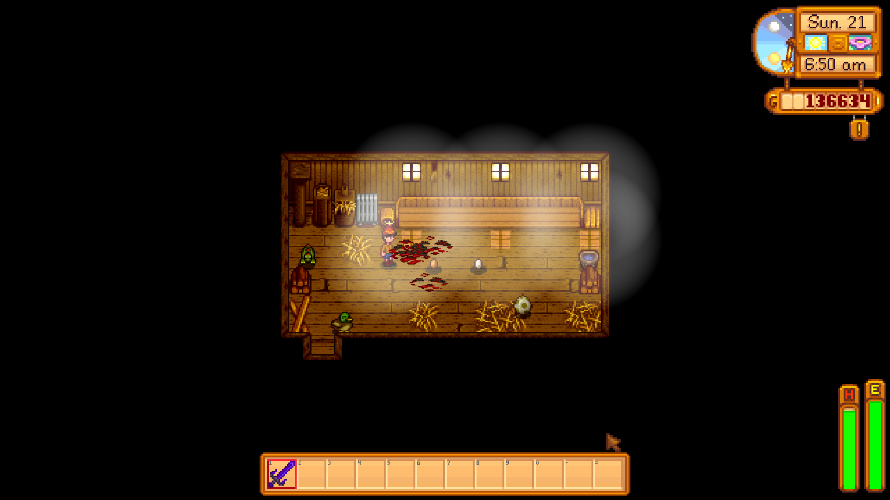


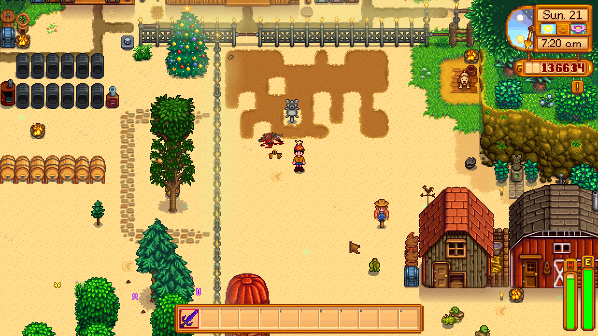
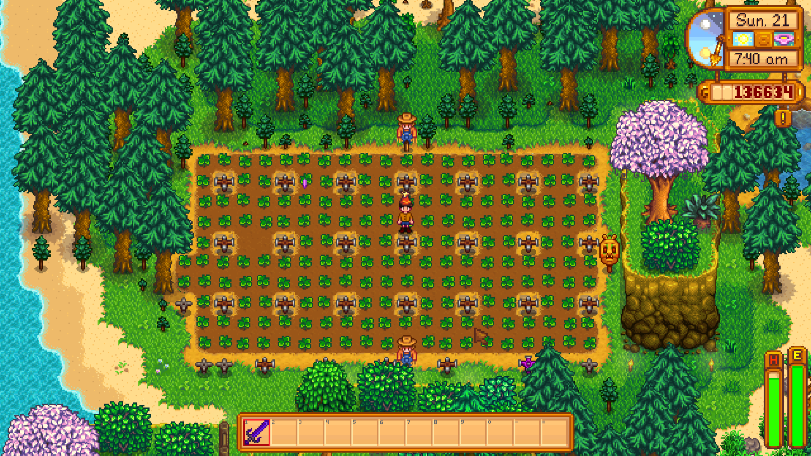


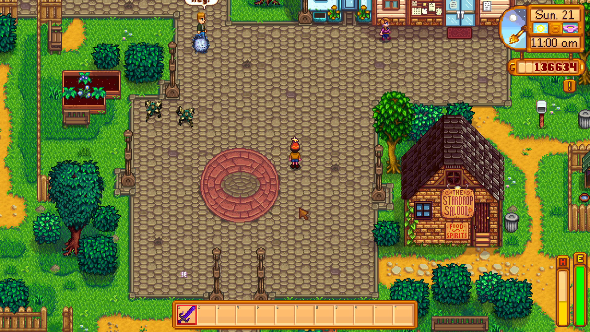
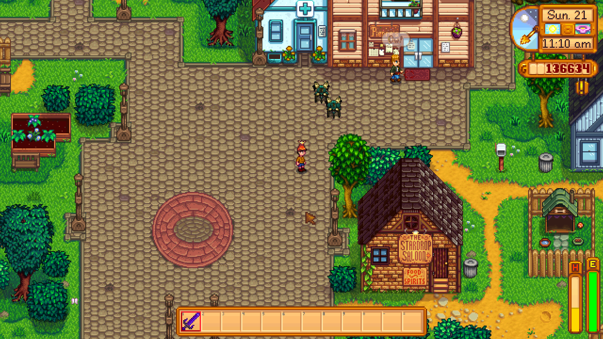
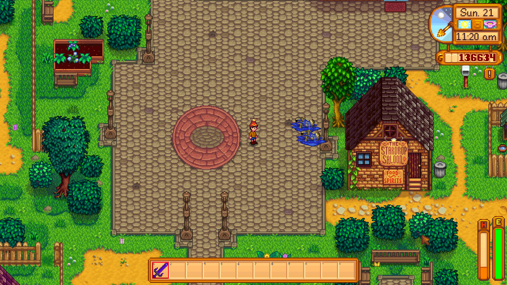


</details>

## 무엇을 하나

- **습격**: 밤이 되면 저그·프로토스·테란 연합군이 농부를 향해 공격 이동합니다. 며칠마다 한 단계씩 강해집니다. F5로 바로 부를 수도 있습니다.
- **반격**: 농부의 칼질과 새총이 OpenBW 유닛에 실제 대미지로 들어갑니다. 보호막이 먼저 깎입니다.
- **방어 시설**: 손에 든 작물을 내고 시즈탱크(B)와 미사일 터렛(N)을 세웁니다. 세이브 파일에 저장됩니다.
- **작물 습격**: 일부 지상 유닛은 농부 대신 밭으로 가서 작물을 먹어 치웁니다.
- **동물과 주민**: 공격받은 동물은 도망가거나 박치기로 반격하고, 주민은 칼을 뽑아 듭니다.
- **기억**: 다른 지역에 갔다가 돌아와도 남아 있던 적은 그 자리에 있습니다. 다음 날 아침 사라집니다.

## 구조

```
┌──────────── Stardew Valley (SMAPI, C#) ────────────┐         ┌──── stardewcraft_guest.exe (C++) ────┐
│ 월드·충돌·농부·동물·주민 위치의 주인                │         │ OpenBW 헤드리스 시뮬레이션            │
│ OpenBW가 보고한 스프라이트를 GRP에서 디코딩해 그림   │ ◀─────▶ │ 유닛·명령·길찾기·전투·애니메이션 주인 │
└────────────────────────────────────────────────────┘ 공유메모리 └──────────────────────────────────────┘
                          Local\StardewCraft_v1 (128 KiB)
```

프로토콜 전체(오프셋, 명령 종류, seqlock 규칙)는 [docs/DESIGN.md](docs/DESIGN.md)에 있습니다.

## 개발 과정

### 1. 조합 고르기
"한 화면에 두 게임"이 눈에 확 들어오는 걸 목표로 했습니다. 스타듀 밸리는 SMAPI로 렌더링과 월드를
자유롭게 다룰 수 있고, 스타크래프트는 OpenBW라는 헤더 온리 C++ 재구현이 있어서 그래픽 없이
시뮬레이션만 돌릴 수 있습니다. 그래서 스타듀를 호스트, OpenBW를 게스트로 정했습니다.

### 2. 리마스터 데이터를 OpenBW에 먹이기
OpenBW는 1.16.1의 MPQ 파일을 기대하지만, 지금 구할 수 있는 스타크래프트 리마스터는 CASC 저장소를
씁니다. [CascLib](https://github.com/ladislav-zezula/CascLib)으로 필요한 파일(`arr/*.dat`, `iscript.bin`,
타일셋, 유닛 GRP)만 뽑는 `tools/casc-extract`를 만들고, OpenBW에는 MPQ 대신 일반 폴더에서 읽는
`directory_loader`를 붙였습니다. `tools/openbw-smoke`에서 마린 대 저글링 전투가 정상적으로 돌아가는
것을 보고 다음 단계로 넘어갔습니다.

### 3. MSVC 없이 빌드하기
개발 PC에 Visual Studio C++ 툴체인이 없어서 `pip install ziglang`으로 받은 zig를
크로스 컴파일러로 씁니다(`x86_64-windows-gnu`). 파이썬만 있으면 빌드됩니다.

### 4. 공유 메모리 프로토콜
호스트→게스트는 64칸짜리 명령 링 버퍼, 게스트→호스트는 seqlock으로 보호되는 스냅샷
(이미지 목록, 유닛 표, 프록시 피해량)입니다. 레이아웃이 바뀔 때마다 버전을 올렸고(현재 4),
양쪽 모두 magic/version이 다르면 실행을 거부합니다. 게임 없이 게스트만 시험할 수 있도록
`tools/fake-host`가 별도 메모리 이름으로 호스트 역할을 합니다.

### 5. 스타듀 지역 → 스타크래프트 맵
지역에 들어갈 때마다 호스트가 타일별 통행 가능 여부를 보내고, 게스트는 그 격자로 CHK 맵을
즉석에서 만듭니다. 타일셋의 cv5/vf4를 뒤져 "전부 걸을 수 있고 건설 가능한" 타일과 "전부 막힌" 타일을
하나씩 골라 칠하고, 나머지 청크는 기본 맵에서 빌려옵니다. 스타듀 1타일(64px)이 BW 1타일(32px)이
되도록 좌표를 절반으로 맞췄습니다.
막혔던 부분: BW는 탐색하지 않은 타일에 건물을 못 짓습니다. 그런데 `explored` 비트는 1이 "아직
탐색 안 함"이라서, 맵 로드 직후 전부 0으로 지워야 터렛이 세워졌습니다.

### 6. 그리기
게스트는 그리기 순서대로 정렬한 이미지 ID, 프레임, 위치, 반전 여부, 플레이어 색만 보냅니다. 호스트는
사용자 데이터의 GRP 프레임을 필요할 때 텍스처로 디코딩하고, 타일셋 팔레트(`.wpe`)와 플레이어 색을
입혀 2배 크기로 그립니다. 그래서 BW 1타일이 스타듀 1타일을 정확히 덮습니다.

### 7. 프록시: 적이 스타듀 쪽을 공격하게 만들기
OpenBW 유닛은 스타듀의 농부를 모릅니다. 그래서 농부·동물·주민마다 보이지 않고 죽지 않는
테란 민간인(Civilian)을 게스트 쪽에 하나씩 세워 둡니다. 깎인 체력은 매 프레임 다시 채우고,
누적 피해량만 호스트에 알립니다. 호스트는 그 값으로 농부 체력을 깎고, 동물을 도망치게 하고,
주민이 반격하게 만듭니다.

### 8. 게임플레이
여기까지 되고 나서 습격 단계, 밤 습격, 작물로 사는 방어 시설(세이브에 저장), 작물 습격,
지역별 적 기억을 차례로 얹었습니다.

### 9. 스크린샷
GDI나 Windows Graphics Capture로 창을 찍으면, 포커스된 전체 크기 게임 화면은 오래된 프레임이
나왔습니다. 그래서 ffmpeg의 Desktop Duplication(`ddagrab`)으로 모니터에 실제로 보이는 게임 영역을
찍습니다(F8).

## 빌드와 설치

필요한 것: 스타크래프트: 리마스터(정품), 스타듀 밸리 + [SMAPI](https://smapi.io) 4.x,
.NET 6 SDK, Python + `pip install ziglang`, Git Bash 같은 sh 환경. 스크린샷 기능을 쓰려면 PATH에 ffmpeg도 있어야 합니다.

```sh
git clone --recurse-submodules <this repo>
cd pass-through

# 1) 본인 스타크래프트 설치본에서 데이터 추출 → data/bw (절대 커밋·배포 금지)
sh scripts/extract-data.sh "C:/Program Files (x86)/StarCraft"

# 2) 게스트(OpenBW) 빌드 → build/stardewcraft_guest.exe
sh scripts/build-guest.sh

# 3) 모드 빌드 + 게임 Mods 폴더에 설치
sh scripts/install.sh "C:/Program Files (x86)/Steam/steamapps/common/Stardew Valley"
```

스타크래프트가 기본 경로에 없다면 처음 실행 뒤 생기는 `Mods/StardewCraft/config.json`에서
`StarCraftDir`을 고쳐 주세요. 기본 맵 `(2)Bottleneck.scm`을 거기서 읽습니다.

## 조작

| 키 | 동작 |
|---|---|
| F5 | 습격 부르기 |
| F6 | 습격자 전부 제거 |
| F7 | 무기 세트 받기 |
| B / N | 손에 든 작물로 시즈탱크 / 미사일 터렛 건설 |
| F8 | 스크린샷 (`%USERPROFILE%\Pictures\StardewCraft`) |

키와 밸런스 값은 모두 `config.json`에서 바꿀 수 있습니다.

## 저장소 구성

| 경로 | 내용 |
|---|---|
| `host/StardewCraft` | SMAPI 모드 (C#) |
| `guest` | OpenBW 게스트 (C++) |
| `tools/casc-extract` | 리마스터 CASC에서 데이터 추출 |
| `tools/openbw-smoke` | OpenBW 헤드리스 동작 확인용 |
| `tools/fake-host` | 게임 없이 게스트를 구동하는 파이썬 호스트 |
| `third_party` | OpenBW, CascLib (git submodule) |

## 법적 고지

- 이 저장소에는 **블리자드의 게임 데이터가 들어 있지 않습니다.** 모든 그래픽과 유닛 데이터는 사용자가
  직접 소유한 스타크래프트: 리마스터에서 로컬로 추출해 씁니다. 추출한 `data/`는 `.gitignore`로 막혀 있습니다.
- StarCraft는 Blizzard Entertainment의, Stardew Valley는 ConcernedApe의 상표입니다. 이 프로젝트는
  비공식 팬 모드이며 두 회사와 아무 관계가 없습니다.
- OpenBW와 CascLib은 각자의 라이선스를 따르며 submodule로만 참조합니다.

## 라이선스

이 저장소의 코드는 [MIT](LICENSE)입니다. `third_party/`의 OpenBW와 CascLib은 포함되지 않으며 각 프로젝트의 조건을 따릅니다.
OpenBW에는 별도 라이선스가 명시돼 있지 않으므로, 빌드된 게스트 실행 파일은 배포하지 않고 소스로만 공개합니다.
